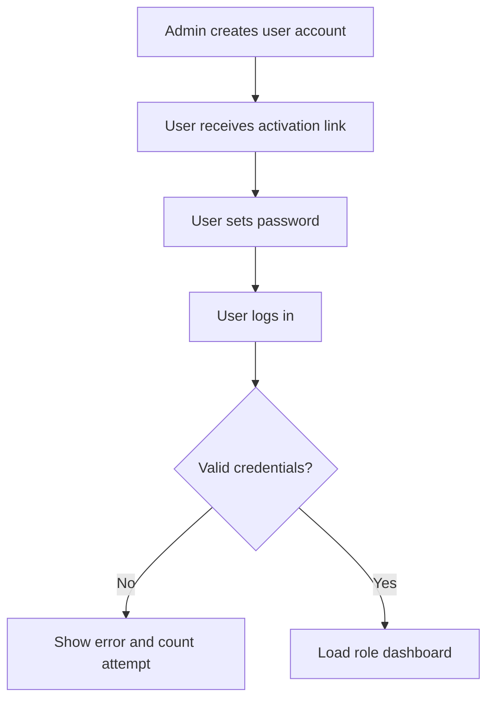
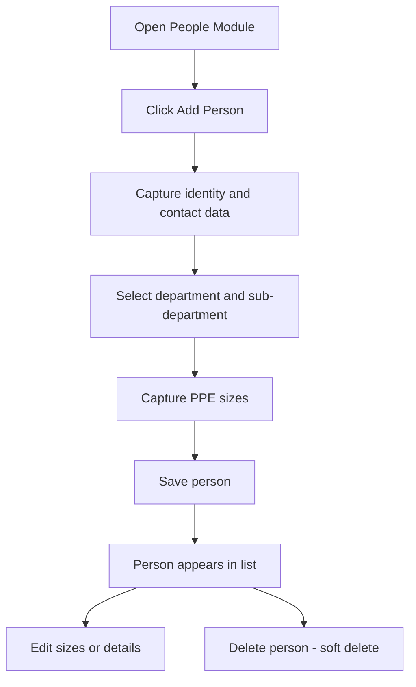
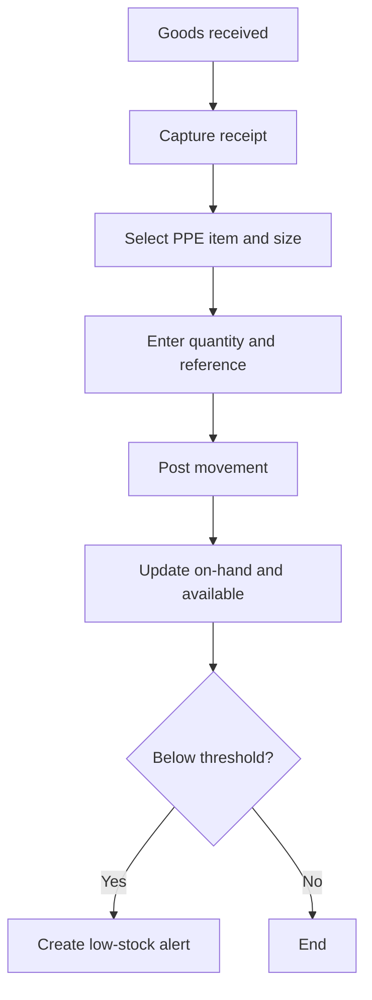
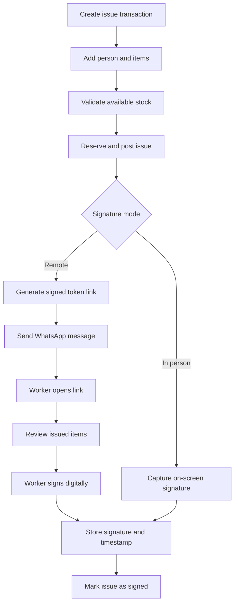

# Core Process Workflows

## 1. User Registration and Login

## 2. People Management

## 3. Stock Intake and Control

## 4. PPE Issue with WhatsApp Signature

## 5. Exception Handling

- If stock validation fails: issue remains in draft, user must change quantity/item.
- If WhatsApp send fails: retry queue with exponential backoff.
- If link expires: authorized user can resend a new link.
- If person is deleted: issue history remains immutable and reportable.
