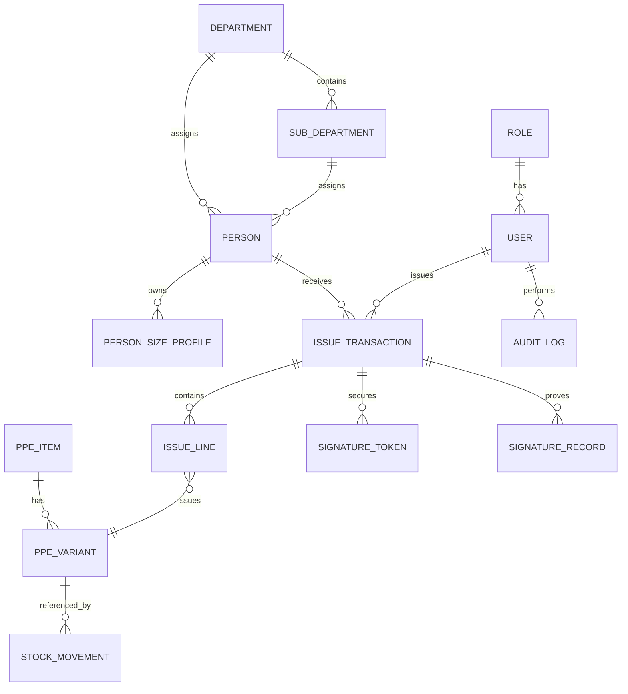

# Domain Model

## Core Aggregates

1. **User**
   - Account identity for login and authorization.
   - Linked to one role and optional person profile.

2. **Person**
   - Employee or worker receiving PPE.
   - Contains demographic data, department links, and PPE sizes.

3. **PPE Item**
   - Master PPE product definition.
   - Linked variants for sizes and optional color/type.

4. **Stock Ledger**
   - Immutable movement entries for receipts, issues, returns, and adjustments.

5. **Issue Transaction**
   - Header and line items for PPE issued.
   - Signature status and proof.

6. **Signature Token**
   - Secure, expiring token for online confirmation.

7. **Audit Event**
   - Immutable action record with actor, entity, and before/after data.

## Relationship Overview

## Status Models

### Issue Status

- `draft`
- `pending_signature`
- `signed`
- `cancelled`

### Person Status

- `active`
- `inactive`
- `terminated`
- `deleted` (soft deleted)

### Token Status

- `created`
- `sent`
- `opened`
- `signed`
- `expired`
- `revoked`
