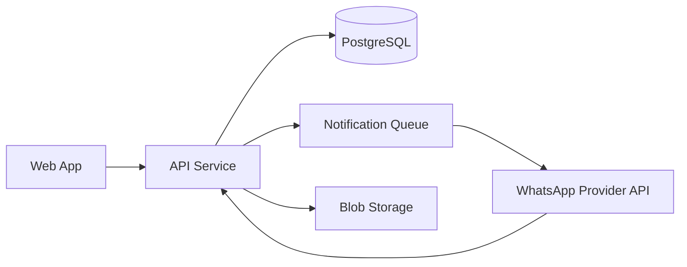

# System Architecture

## Architecture Style

- Web-based, modular monolith (initially)
- REST API backend
- Relational database (PostgreSQL)
- Event/outbox pattern for notifications (WhatsApp, email)

## High-Level Components

1. **Web Frontend (React or similar)**
   - Login and registration screens
   - Dashboard and analytics
   - People, PPE, stock, issue modules
   - Signature review and receipt views

2. **API Service**
   - Auth and session management
   - Business logic (people, stock, issue, signing)
   - Role/permission enforcement
   - Reporting endpoints

3. **Database**
   - Master data
   - Transactional issue and stock records
   - Audit logs
   - Notification delivery logs

4. **WhatsApp Integration Service**
   - Message dispatch
   - Delivery callbacks
   - Retry handling

5. **File/Blob Storage**
   - Signature images or vector payloads
   - Generated report documents

## Logical Diagram

## Key Security Controls

- JWT-based stateless access tokens + rotating refresh tokens
- RBAC checks at endpoint and service level
- Signed link tokens with expiry and single-use constraints
- Full audit trail for privileged actions
- Input validation and server-side business rule checks

## Non-Functional Targets

- Availability target: 99.5% monthly
- API p95 latency: under 500ms for standard requests
- Concurrent active users target: 200 (initial)
- Data retention: configurable, default 7 years for issue records

## Suggested Deployment Topology

- Reverse proxy/load balancer
- API container instances
- Managed PostgreSQL
- Managed object storage
- Background worker for notification retries
